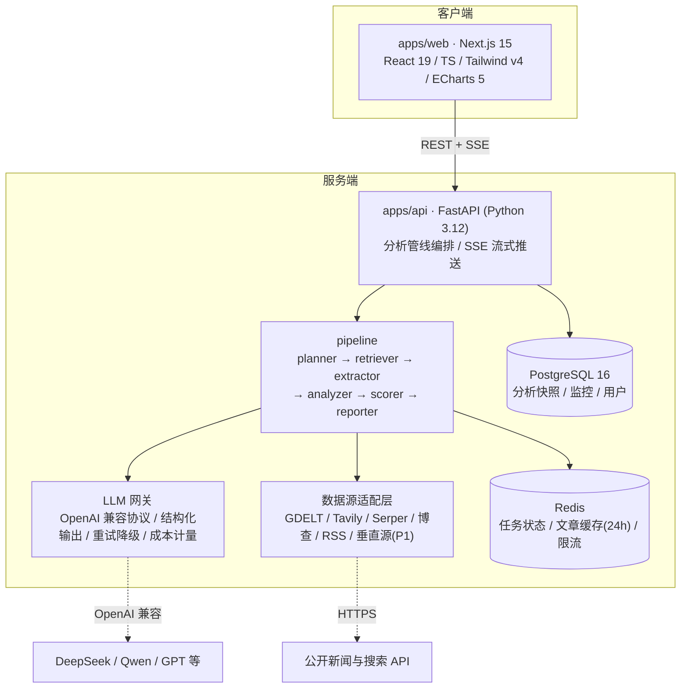
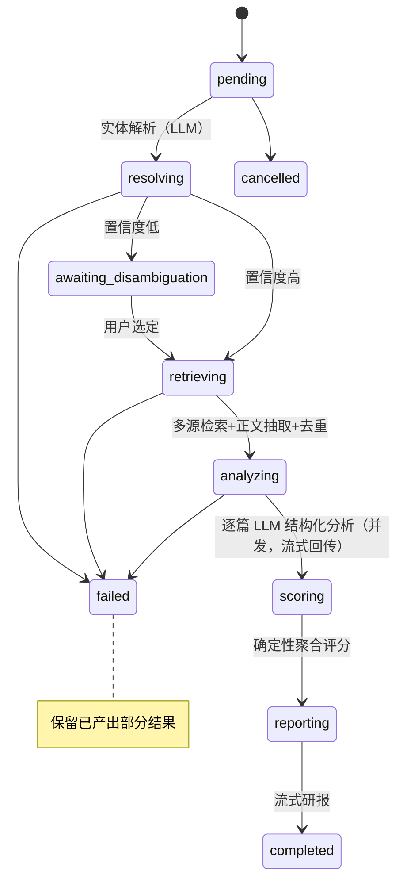
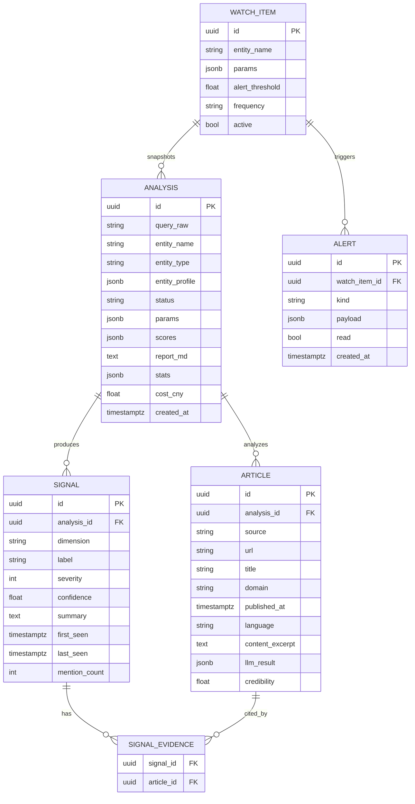

# 舆图 · 技术架构文档

> 版本：v1.0 · 对应 PRD v1.0 · 更新日期：2026-07-28

## 1. 总体架构



**核心决策**：

- **前后端分离双服务**。分析管线是长耗时（30-90s）、高并发的异步编排任务，Python 异步生态（httpx/asyncio/pydantic）与 LLM 结构化输出工具链最成熟，故后端独立为 FastAPI 服务；前端专注流式渲染与可视化；
- **契约先行**：API 以 FastAPI 自动生成的 OpenAPI 为唯一契约，前端用 `openapi-typescript` 生成类型，杜绝手写接口漂移；
- **LLM 可插拔**：全部 LLM 调用走 OpenAI 兼容协议网关，模型/provider 以环境变量切换，业务代码零感知；
- **数据源可插拔**：每个源一个适配器，统一返回 `RawArticle`，启停与降级由配置驱动；
- **评分确定性**：LLM 只负责抽取与研判（带置信度），分数计算是确定性代码——可测试、可解释、可复现。

## 2. 技术选型

| 层 | 选型 | 理由 |
| --- | --- | --- |
| 前端框架 | Next.js 15（App Router）+ React 19 + TypeScript | RSC 减包、SSE 友好、生态成熟 |
| 样式 | Tailwind CSS v4 + shadcn/ui + lucide-react | 工作台类高密度 UI 效率最高 |
| 图表 | ECharts 5（按需引入，自封装 React 薄组件） | 延续原项目基因，雷达/双轴/地图能力全 |
| 状态/数据 | Zustand + 原生 EventSource 封装 | SSE 增量状态用 store 即可，不引入重型查询库 |
| 后端框架 | FastAPI + Python 3.12 + uvicorn | 异步、OpenAPI 免费、pydantic 与 LLM 结构化输出天然契合 |
| LLM 调用 | openai SDK（AsyncOpenAI, base_url 可配）+ JSON Schema response_format | provider 无关；结构化输出强约束 |
| 正文抽取 | trafilatura（主）+ readability-lxml（备） | 中文站点覆盖好、纯 Python |
| 去重 | datasketch（MinHash）+ URL 规范化 | 转载聚簇轻量可靠 |
| 数据库 | PostgreSQL 16 + SQLAlchemy 2（async）+ Alembic | 快照/监控持久化；P1 可加 pgvector 做语义聚类 |
| 缓存/队列 | Redis 7（任务状态、文章缓存、令牌桶限流） | MVP 期管线以 asyncio 进程内编排，Redis 只做状态与缓存 |
| 部署 | docker-compose（web/api/postgres/redis） | 本地一键；后续可平滑迁移 K8s |
| 质量 | ruff + mypy（api）、eslint + tsc（web）、pytest、vitest、Playwright | 双端类型与测试基线 |

## 3. 仓库结构（Monorepo，pnpm workspace，无 Turborepo 依赖）

```
RiskAtlas/
├── apps/
│   ├── web/                    # Next.js 15 前端
│   │   ├── app/                # App Router 路由（/、/analysis/[id]、…）
│   │   ├── components/         # 面板与图表组件
│   │   ├── lib/                # api client（生成的类型）、SSE store、工具
│   │   └── package.json
│   └── api/                    # FastAPI 后端
│       ├── app/
│       │   ├── main.py         # 应用入口、路由挂载、CORS
│       │   ├── config.py       # pydantic-settings，全部环境配置
│       │   ├── routers/        # analyses / articles / watchlist(P1) / health
│       │   ├── pipeline/       # 分析管线各阶段（见第 4 节）
│       │   ├── llm/            # LLM 网关、prompts、schemas
│       │   ├── sources/        # 数据源适配器（见第 5 节）
│       │   ├── scoring/        # 风险评分引擎（见第 6 节）
│       │   ├── models/         # SQLAlchemy 模型
│       │   └── schemas/        # pydantic API 模型（OpenAPI 契约源）
│       ├── tests/
│       └── pyproject.toml
├── docs/                       # 本文档族
├── backup/                     # 原项目存档（不进入构建）
├── docker-compose.yml
├── .env.example
└── package.json                # workspace 根，dev 脚本聚合
```

## 4. 分析管线设计

管线是系统的心脏。一次分析 = 一个有状态机生命周期的任务，各阶段产出通过 SSE 增量推送。

### 4.1 阶段状态机



### 4.2 各阶段职责与关键参数

| 阶段 | 模块 | 职责 | 关键参数（默认） |
| --- | --- | --- | --- |
| 1 实体解析 | `pipeline/planner.py` | LLM 判定实体类型、生成别名/英文名/扩展查询词、估计消歧置信度 | 扩展查询词 ≤6 组；置信度阈值 0.7 |
| 2 检索 | `pipeline/retriever.py` | 按扩展查询词并行调用全部启用的源适配器，汇总去重 | 单源 ≤25 条，总计 ≤100 条；单源超时 10s |
| 3 正文抽取 | `pipeline/extractor.py` | 并发抓取正文、清洗、语言检测、截断；失败仅保留标题摘要 | 并发 10；正文截断 3000 字符；Redis 缓存 24h |
| 4 去重聚簇 | `pipeline/deduper.py` | URL 规范化去重 + MinHash 标题近重，聚为事件簇 | 相似度阈值 0.7；簇内保留全部来源 |
| 5 单篇分析 | `pipeline/analyzer.py` | 逐簇（代表文+其余标题）调 LLM 结构化分析；结果校验与重试 | 并发 5；失败重试 ≤2；分析上限 40 簇 |
| 6 信号归并 | `pipeline/signals.py` | 跨簇同类事件合并为 Signal，挂载证据 | 同类=同维度+事件标签+时间窗重叠 |
| 7 评分 | `scoring/engine.py` | 确定性计算六维分、综合分、等级（第 6 节） | 权重/衰减参数配置化 |
| 8 研报 | `pipeline/reporter.py` | 以信号+统计为上下文流式生成中文研报，引用编号校验 | 仅可引用已检索文章；token 上限可配 |

### 4.3 SSE 事件协议（`GET /api/v1/analyses/{id}/events`）

| event | data 摘要 | 时机 |
| --- | --- | --- |
| `status` | `{stage, message}` | 每次阶段切换 |
| `entity` | 解析出的实体画像与扩展查询词 | 阶段 1 完成 |
| `disambiguation` | 候选实体列表 | 需用户选择时 |
| `retrieval_stats` | `{fetched, after_dedup, clusters, sources:[{name,status,count}]}` | 阶段 4 完成 |
| `article_analyzed` | `{done, total, current:{title, sentiment, relevance}}` | 阶段 5 每簇 |
| `signal` | 完整 Signal 对象 | 阶段 6 每产出一条 |
| `scores` | 六维分+综合分+等级+样本量 | 阶段 7 完成 |
| `timeline` / `sources_stats` | 图表聚合数据 | 阶段 7 完成 |
| `report_chunk` | `{text}` | 阶段 8 流式 |
| `error` / `completed` | 错误或终态摘要 | 终态 |

前端以 Zustand store 按事件类型增量更新各面板，实现"一块一块亮起来"。

## 5. 数据源适配层

统一接口（Python Protocol）：

```python
class NewsSource(Protocol):
    name: str
    async def search(self, query: str, *, days: int, lang: str, limit: int) -> list[RawArticle]: ...

class RawArticle(BaseModel):
    source: str            # 适配器名，如 "gdelt"
    url: str
    title: str
    snippet: str | None    # 搜索侧摘要
    published_at: datetime | None
    language: str | None
    domain: str
```

内置适配器规划：

| 适配器 | 认证 | 覆盖 | 备注 |
| --- | --- | --- | --- |
| `gdelt.py` | 免 key | 全球新闻，中文可 | GDELT 2.1 DOC API，`timespan` 参数，返回 JSON |
| `rss.py` | 免 key | 配置的媒体 RSS | feedparser，源列表配置化 |
| `tavily.py` | key | 中英文网页搜索 | 商业 API，`TAVILY_API_KEY` |
| `serper.py` | key | Google 结果 | 商业 API，`SERPER_API_KEY` |
| `bocha.py` | key | 中文网页搜索优化 | 商业 API，`BOCHA_API_KEY` |
| `vertical/*.py`（P1） | key | 监管/司法/公告 | 合规授权后接入，同接口 |

编排规则：全部启用源并发执行，单源失败记 `status=degraded` 不阻断；来源可信度表（`source_credibility`，0-1）维护在配置中，供评分使用，默认 0.6，权威媒体/官方源上浮。

## 6. 风险评分引擎（确定性）

LLM 输出原料，代码计算分数。对维度 d，其信号集合 S_d：

```
weight(s) = severity(s) × confidence(s) × credibility(s) × decay(s)
decay(s)  = 0.5 ^ (days_since_first_seen / half_life)     # half_life 默认 30 天
raw_d     = Σ weight(s),  s ∈ S_d
score_d   = 100 × (1 − e^(−raw_d / k))                    # k=8，饱和压缩防刷分
overall   = Σ w_d × score_d
```

- 默认维度权重 w_d：司法诉讼 0.22、财务信用 0.22、监管合规 0.18、经营治理 0.14、产品质量 0.12、声誉舆情 0.12（配置化）；
- 等级映射：`<20` 低 / `<40` 中低 / `<60` 中 / `<80` 中高 / `≥80` 高；
- **样本保护**：相关文章 <5 篇时整体结论标记 `insufficient_data`，只展示事实列表不展示等级；
- **可解释**：每个维度返回贡献 Top3 信号 id 与各自 weight，前端下钻展示；
- 参数集中在 `scoring/config.py`，配单元测试锁定公式行为。

## 7. 数据模型（PostgreSQL）



要点：`ARTICLE.content_excerpt` 只存截断摘要且随分析快照生命周期管理；用户体系（P1）加 `USER` 表关联即可；分享链接 = `ANALYSIS.share_token`（uuid，只读）。

## 8. API 契约（v1 前缀 `/api/v1`）

| 方法 | 路径 | 说明 |
| --- | --- | --- |
| POST | `/analyses` | 创建分析：`{query, days, language, region?}` → `{id}` |
| GET | `/analyses/{id}` | 当前快照（轮询/刷新恢复用） |
| GET | `/analyses/{id}/events` | SSE 事件流（协议见 4.3） |
| POST | `/analyses/{id}/disambiguate` | 提交用户选定实体 |
| POST | `/analyses/{id}/cancel` | 取消任务 |
| GET | `/analyses/{id}/signals` | 信号列表（可按维度筛选） |
| GET | `/analyses/{id}/articles` | 文章列表（证据） |
| POST | `/analyses/{id}/followups`（P1） | 追问（SSE 流式回答） |
| GET | `/analyses?limit=`（P1） | 历史列表 |
| GET/POST/DELETE | `/watchlist`（P1） | 监控 CRUD |
| GET | `/health` | 存活与依赖检查 |

FastAPI 生成 OpenAPI 3.1 → `openapi-typescript` 输出 `apps/web/lib/api-types.ts`，CI 校验生成物与后端同步。

## 9. 前端架构要点

- **路由**：`/`（搜索）、`/analysis/[id]`（驾驶舱，client component 为主）；
- **数据流**：`lib/sse-store.ts` 建立 EventSource → 解析事件 → 写入 Zustand 分片（entity/progress/articles/signals/scores/report）；组件只订阅自己需要的分片；
- **图表封装**：`components/charts/` 下对 ECharts 做薄封装（`RiskGauge`、`Radar`、`TrendChart`、`Donut`），统一主题与 resize；
- **研报渲染**：`react-markdown` + 自定义引用角标组件，角标点击滚动定位到证据卡；
- **可恢复**：驾驶舱挂载时先拉 `/analyses/{id}` 快照，进行中再接 SSE 增量；
- **降级**：SSE 断线自动退化为 3s 轮询快照。

## 10. LLM 使用契约与成本控制

- **单篇分析 schema**（response_format 强约束）：`{relevance: 0-1, sentiment: {label, score: -1..1}, events: [{dimension, label, severity: 1-5, confidence, summary}], mentioned_entities: [...]}`；校验失败重试 ≤2 次；
- **prompt 管理**：`llm/prompts/` 每任务一个文件，含版本号与少量 few-shot；系统提示固定注入六维分类法定义；
- **幻觉防护**：研报 prompt 只允许使用 `[文章编号]` 引用；生成后正则提取引用编号，校验存在性，非法引用剔除该句并记录；
- **成本**：逐调用计量（input/output token × 单价表），累计超预算（默认 ¥0.5）时停止非必要分析（跳过低相关簇），研报仍基于已有数据生成；
- **超时与降级**：单次调用 30s 超时；provider 5xx 指数退避重试 2 次，仍失败则该簇标记 `analysis_failed` 继续整体流程。

## 11. 安全、合规与隐私

- 所有第三方 key 仅存服务端 `.env`（不入库、不进前端包）；`.env.example` 提供模板；
- CORS 仅允许前端源；匿名配额按 IP+会话令牌限流（Redis 令牌桶，默认 10 次/小时）；
- 文章正文缓存 24h 后清除，持久层仅存摘要与元数据（版权友好）；尊重 robots.txt；
- 页面常驻"由公开信息与 AI 分析生成，仅供参考，不构成投资建议"免责声明；
- 日志不落文章全文与 prompt 全文（只留 hash 与长度）。

## 12. 部署与运行

`docker-compose.yml` 编排 4 个服务：`web`（Next.js，:3000）、`api`（uvicorn，:8000）、`postgres`（:5432）、`redis`（:6379）。本地开发支持双进程热更新（`pnpm dev` 并行启动 web 与 uvicorn --reload）。生产构建：web 静态+SSR 镜像，api slim Python 镜像；环境差异全部由 env 注入。

## 13. 可观测性

- 结构化日志（JSON，含 analysis_id、stage、耗时、token、成本）；
- 管线每阶段计时与计数入库 `ANALYSIS.stats`，前端"过程可见"面板直接消费；
- 预留 OpenTelemetry hook（P1 接 Jaeger/Tempo）。

## 14. 测试策略

| 层 | 内容 |
| --- | --- |
| api 单测（pytest） | 评分引擎（公式锁定）、去重聚簇、schema 校验与重试、适配器（respx mock HTTP）、SSE 事件序列 |
| api 集成 | 管线端到端：LLM 与源全部 mock，断言状态机与产出物 |
| web 单测（vitest） | SSE store 事件归约、图表数据映射 |
| e2e（Playwright） | 搜索→驾驶舱渲染→信号展开证据（后端以 fixture 模式运行，返回固定数据） |
| 契约 | CI 中重新生成 api-types.ts 并 diff，防止漂移 |
