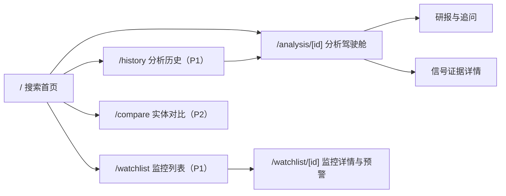
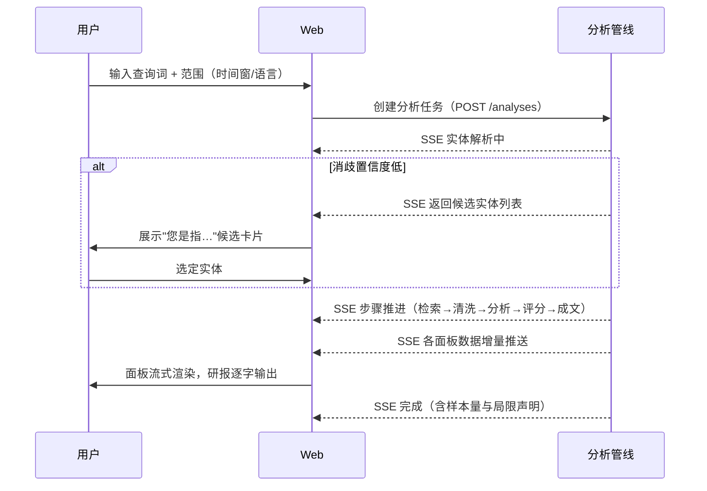

# 舆图 · 交互设计文档

> 版本：v1.0 · 对应 PRD v1.0 · 更新日期：2026-07-28

## 1. 设计原则

1. **结论先行，证据紧随**：首屏第一屏永远是风险总分与等级，所有 AI 论断一键可达原始证据；
2. **渐进披露**：分析进行中流式填充面板，先粗后细，不让用户盯着转圈；
3. **过程可见**：分析管线（检索→清洗→分析→评分→成文）以步骤条实时可见，AI 不是黑盒；
4. **工具属性**：这是风控工作台而非内容网站——信息密度高、导航可预期、操作可重复；
5. **诚实表达**：样本量、置信度、信息缺口与免责声明常驻可见。

## 2. 信息架构



MVP 页面：搜索首页、分析驾驶舱（含研报）。P1 增加监控、历史、分享只读页。

## 3. 核心流程

### 3.1 搜索 → 驾驶舱主流程



### 3.2 关键交互细节

- **搜索框**：居中大字输入框，支持下拉历史与示例查询；高级选项（时间窗 7/30/90 天、语言、地域）默认折叠；
- **分析中状态**：顶部固定步骤条（实体解析→多源检索→AI 分析→风险评分→生成研报），每步显示实时计数（"已检索 47 篇 · 去重后 32 篇 · 已分析 18/32"），可随时取消；
- **取消与超时**：取消保留已产出部分结果；超过 90s 未完成自动截断并提示；
- **重新分析**：驾驶舱右上角"重新分析"（同实体新时间窗快照），结果入历史。

## 4. 分析驾驶舱布局

桌面端 12 栏网格，面板按数据就绪顺序流式入场（位移+淡入，≤300ms）：

```
+--------------------------------------------------------------+
| 实体名 · 类型徽章 · 时间窗 · 样本量 · 步骤条/状态   [重新分析] |
+---------------------------+----------------------------------+
| A. 风险总览               | B. AI 风险研报（流式）           |
|  综合分仪表+等级           |  总评/分维度解读/关键事件/局限    |
|  六维雷达图               |  [追问输入框 P1]  [导出 P1]      |
+---------------------------+----------------------------------+
| C. 舆情走势（声量x情绪双轴时间线，事件标注）                   |
+---------------------------+----------------------------------+
| D. 风险事件流（信号列表）  | E. 来源与情绪分布                |
|  维度筛选·严重度排序       |  域名Top10·正负面占比·媒体类型    |
|  证据展开                 |                                  |
+---------------------------+----------------------------------+
```

面板职责与组件规格：

| 面板 | 组件 | 规格 |
| --- | --- | --- |
| A 总览 | 仪表（半环 gauge）+ 等级徽章 + 雷达图 | 分数 0-100；等级五色；雷达六维，点击维度联动筛选事件流 |
| B 研报 | Markdown 流式渲染 | 引用角标 [n] 可点击定位证据；分节骨架屏占位 |
| C 走势 | 双轴折线/柱状 | 日粒度声量柱 + 情绪均值线；事件日标注旗帜；hover 显示当日 Top 标题 |
| D 事件流 | 信号卡片列表 | 每张卡：维度标签、严重度（1-5 格）、摘要、媒体数/时间范围；展开显示证据文章列表（标题+域名+日期+外链） |
| E 分布 | 横向条形 + 环形 | 来源域名 Top10；正/中/负占比环图 |

## 5. 图表与状态规范

- **图表库**：ECharts 5（延续原项目基因）；统一主题：网格线极浅、轴线隐藏、tooltip 深色、数字等宽字体；
- **风险色阶**（全局唯一语义）：低 `#16a34a` / 中低 `#84cc16` / 中 `#eab308` / 中高 `#f97316` / 高 `#dc2626`；禁止在其他场景复用这组颜色；
- **情绪色**：负面 `#dc2626`、中性 `#94a3b8`、正面 `#16a34a`；
- **加载态**：每个面板独立骨架屏；数据部分就绪时面板内分区填充，不做整页 loading；
- **空态**：无信号维度显示"该维度未检索到风险事件（样本 n）"，不显示 0 分误导；
- **降级态**：某数据源失败时，页头出现可折叠提示条"GDELT 源不可用，本次结果基于其余 N 个源"；
- **错误态**：任务失败保留已产出数据，提供重试按钮与错误摘要。

## 6. 视觉语言

- **整体气质**：金融工作台——浅色背景（`#f8fafc`）+ 白面板 + 1px 浅边框，深色导航栏；不使用渐变卡片堆叠与营销式排版；
- **字体**：中文 PingFang/思源黑体，数字与代码 JetBrains Mono；页面标题 20px，面板标题 14px，正文 13px；
- **密度**：面板内边距 16px，卡片间距 16px，圆角 ≤8px；表格行高 36px；
- **图标**：lucide 线性图标；维度、步骤、操作均有图标+文字或 tooltip；
- **动效**：仅用于面板入场、数值滚动（count-up 600ms）与展开收起；不做装饰性动效。

## 7. 响应式

- ≥1280px：上示双栏布局；
- 768-1280px：A/B 面板纵向堆叠，C/D/E 单列；
- <768px：单列，雷达图与仪表合并为摘要卡，事件流卡片化全宽；追问输入固定底部。

## 8. 可访问性

- 风险等级同时以颜色+文字+图标三通道表达（不单独依赖颜色）；
- 所有图表提供数据表格切换视图；
- 键盘可完成：搜索→提交→面板跳转→证据展开 全流程。
